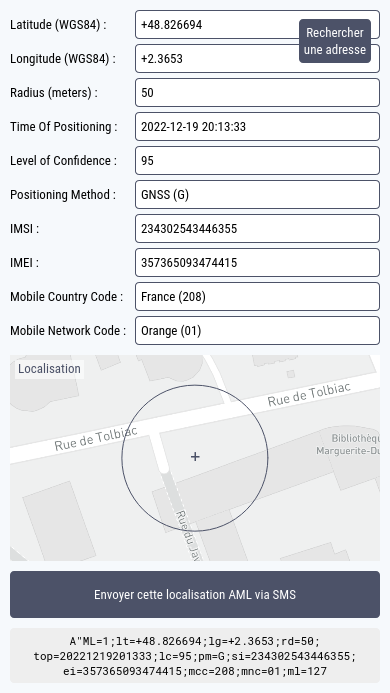
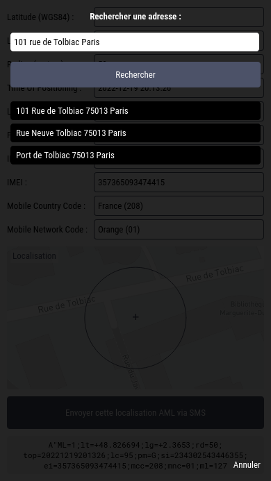

L'Advanced Mobile Location (AML) est un service de géolocalisation d'urgence disponible sur les smartphones. Lorsqu'un appelant compose le numéro d'appel d'urgence, il envoie par SMS, aux services de secours, automatiquement et sans action supplémentaire de sa part, toutes les informations de géolocalisation dont il dispose. L'utilisation de ce service améliore le temps nécessaire à la localisation des appelants et réduit le délai de l'intervention d'urgence. Cette technologie est intégrée dans près de 90% des smartphones vendus en Europe.

Cette application permet de construire un SMS en respectant le format utilisé par l'AML. Ce SMS doit être envoyé avec le même numéro que celui qui passe l'appel d'urgence. Le destinataire de ce SMS doit être le numéro de téléphone de la platerforme AML.

 

# Format du message

Un message envoyé par l'AML est un ensemble de paires clef/valeur (clef=valeur), séparées par des points-virgules.

La première paire clef/valeur est une sorte d'entête obligatoire :

    A"ML=1

En considérant les points-virgules comme séparateurs pour le message suivant...

    A"ML=1;lt=+48.902963;lg=+2.516582;rd=1964;top=20220210134654;lc=95;pm=G;si=234302543446355;ei=357365093474415;mcc=208;mnc=01;ml=131

...on identifie facilement toutes les paires clef/valeur (clef=valeur):

    A"ML=1
    lt=+48.902963
    lg=+2.516582
    rd=1964
    top=20220210134654
    lc=95
    pm=G
    si=234302543446355
    ei=357365093474415
    mcc=208
    mnc=01
    ml=131

# Description des paires clef/valeur attendues

## Latitude

Latitude du positionnement, exprimée en WGS84, avec signe (+ ou -)

    lt=+48.902963

## Longitude

Latitude du positionnement, exprimée en WGS84, avec signe (+ ou -)

    lg=+2.516582

## Radius

Rayon de précision, exprimé en mètres

    rd=1964

## Time Of Positioning

Date de la localisation exprimée au format YYYYMMDDhhmmss

    top=20220210134654

## Level of Confidence

Niveau de confiance dans la localisation envoyée, exprimé en pourcentage

    lc=95

## Positioning Method

Méthode de positionnement utilisée (G pour Glonass, W pour Wifi et C pour Cell)

    pm=G

## IMSI

Identifiant de la carte SIM utilisée (International Mobile Subscriber Identity)

    si=234302543446355

## IMEI

Identifiant du smartphone utilisé (International Mobile Equipment Identity)

    ei=357365093474415

## Mobile Country Code

Identifiant du pays de provenance du SMS

    mcc=208

## Mobile Network Code

Identifiant de l'opérateur de provenance du SMS

    mnc=01

## Message Length

Nombre de caractères total du message (l'entête et cette paire clef/valeur comprises)

    ml=131

# Sources

## AML

> https://fr.wikipedia.org/wiki/Localisation_mobile_avanc%C3%A9e

> https://eena.org/knowledge-hub/documents/aml-specifications-requirements/

## IMSI / IMEI

> https://fr.wikipedia.org/wiki/International_Mobile_Subscriber_Identity

> https://fr.wikipedia.org/wiki/International_Mobile_Equipment_Identity

## MCC / MNC

> https://fr.wikipedia.org/wiki/Mobile_country_code

> https://fr.wikipedia.org/wiki/Mobile_Network_Code